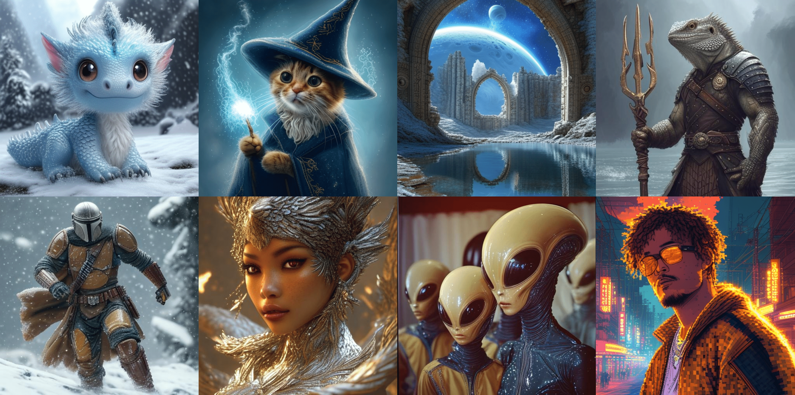

# Switti: Designing Scale-Wise Transformers for Text-to-Image Synthesis
<a href='https://arxiv.org/pdf/2412.01819'></a> &nbsp; 
<a href='https://yandex-research.github.io/switti/'></a> &nbsp; 
<a href="https://huggingface.co/spaces/dbaranchuk/Switti">
	    
</a>

<p align="center">

<p>
We present Switti, a scale-wise transformer for fast text-to-image generation that outperforms existing T2I AR models and competes with state-of-the-art T2I diffusion models while being faster than distilled diffusion models.

This repo contains training code for our models (Switti and Switti (AR)) and an inference example.
## 🔥 News!
* Dec 29, 2024: models for 1024x1024 are released
* Dec 5, 2024: Paper, demo, training and inference code are released
  
## HF🤗 Models
| Model | Resolution |
|:---|:---|
|[Switti](https://huggingface.co/yresearch/Switti) | 512x512 |
|[Switti AR](https://huggingface.co/yresearch/Switti-AR) |  512x512 
|[Switti-1024](https://huggingface.co/yresearch/Switti-1024) | 1024x1024 |
|[Switti-1024-AR](https://huggingface.co/yresearch/Switti-1024-AR) |  1024x1024 |

We also release our fine-tuned version of [VQVAE](https://huggingface.co/yresearch/VQVAE-Switti), which is capable of reconstruction in both 512x512 and 1024x1024.

# Setup

## Environment
First, create a new environment and install Pytorch using conda:
```bash
conda create -n switti python=3.11
conda activate switti
conda install pytorch==2.4.1 torchvision==0.19.1 torchaudio==2.4.1 pytorch-cuda=12.4 -c pytorch -c nvidia
```

Next, install other libraries required for training and inference via pip
```bash
pip install -r requirements.txt
```

### [Optional] Install Apex
Apex is not essential to run our code, however it can accelerate both training and inference to some extent.

To install apex from source:
```bash
git clone https://github.com/NVIDIA/apex
cd apex
# if pip >= 23.1 (ref: https://pip.pypa.io/en/stable/news/#v23-1) which supports multiple `--config-settings` with the same key...
pip install -v --disable-pip-version-check --no-cache-dir --no-build-isolation --config-settings "--build-option=--cpp_ext" --config-settings "--build-option=--cuda_ext" ./
# otherwise
pip install -v --disable-pip-version-check --no-cache-dir --no-build-isolation --global-option="--cpp_ext" --global-option="--cuda_ext" ./
```

# Training

## Data
We provide the training example on the [COCO](https://cocodataset.org/#download) dataset, that needs to be prepared in the following format:
```
/path/to/data/:
    train2014/:
        COCO_train2014_000000000009.jpg
        COCO_train2014_000000000025.jpg
        ...
    train2014.csv
```
Where `/path/to/data/train2014.csv` is a table with the following header:
```csv
,file_name,caption
0,COCO_train2014_000000057870.jpg,A restaurant has modern wooden tables and chairs.
```
Path to the folder containing the prepared COCO dataset is used as `--data_path` argument in a training script.

## Training script
A minimal example of training on several GPUs using FSDP can be found at `sh_scripts/train_example.sh`.

During training, intermediate checkpoints and tensorboard logs will be saved to the `local_output` folder.

Set `--use_ar=true` to train an AutoRegressive version of Switti


# Inference
You can start generating images with Switti using this code snippet: 
```python
import torch
from models import SwittiPipeline

device = 'cuda:0'
model_path = "yresearch/Switti"

pipe = SwittiPipeline.from_pretrained(model_path, device=device, torch_dtype=torch.bfloat16)

prompts = ["Cute winter dragon baby, kawaii, Pixar, ultra detailed, glacial background, extremely realistic",
           "flying robot koi fish with armour plating, neon glowing eyes and wiring, 4k, unreal engine, marvel comics style",
           "sci-fi cosmic diorama of a quasar and jellyfish in a resin cube, volumetric lighting, high resolution, hdr, sharpen, Photorealism",
           "A cloud dragon flying over mountains, its body swirling with the wind.",
          ]
images = pipe(prompts,
              cfg=6.0,
              top_k=400,
              top_p=0.95,
              more_smooth=True,
              return_pil=True,
              smooth_start_si=2,
              turn_on_cfg_start_si=0,
              turn_off_cfg_start_si=8,
              last_scale_temp=0.1,
              seed=59,
             )
```
Alternatively, you can experiment with Switti inference using various sampling parameters via [HuggingFace demo](https://huggingface.co/spaces/dbaranchuk/Switti) or a Jupyter notebook [inference_example.ipynb](inference_example.ipynb).

# Citation
```bibtex
@article{voronov2024switti,
	title={Switti: Designing Scale-Wise Transformers for Text-to-Image Synthesis}, 
	author={Anton Voronov and Denis Kuznedelev and Mikhail Khoroshikh and Valentin Khrulkov and Dmitry Baranchuk},
	year={2024},
	eprint={2412.01819},
	archivePrefix={arXiv},
	primaryClass={cs.CV},
	url={https://arxiv.org/abs/2412.01819}
}
```
